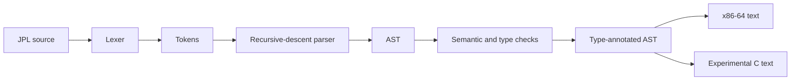

# JPL Compiler

A compiler written in Python for JPL, a statically typed language with array
computations and image-oriented language constructs. The implementation includes
a handwritten lexer, recursive-descent parser, type-annotated AST, an x86-64
assembly emitter, and an experimental C emitter.

This project builds on starter/template infrastructure supplied for CS 4470:
Compilers. The compiler implementation evolved in this repository through
collaborative work; course-provided scaffolding and the separately supplied
runtime are not claimed as original work by the repository maintainer. See
[attribution and provenance](docs/attribution.md) for the source distinction.
The repository now provides local checks independent of course submission tools.
The backends are incomplete; the implementation notes distinguish working
frontend features from partial code generation.

## Try the compiler

Use **Python 3.12 or newer**. The compiler uses only the Python standard library.
The assembly emitter contains f-string syntax that requires Python 3.12.
Run these commands from the repository root:

```sh
python compiler.py -l test.jpl
python compiler.py -p test.jpl
python compiler.py -t test.jpl
python compiler.py -s examples/subtract.jpl
python compiler.py -s -O1 examples/subtract.jpl
```

Use `python3` instead of `python` if that is the name of your Python 3.12+
executable. These commands inspect compilation stages and emit text; they do
not assemble, link, or execute a native program.

| Option | Output |
| --- | --- |
| `-l` | Tokens |
| `-p` | AST as S-expressions |
| `-t` | Type-annotated S-expressions |
| `-i` | Experimental C output, with known correctness gaps |
| `-s` | NASM-style x86-64 assembly text |
| `-s -O1` | Assembly with local code-generation optimizations |
| `-s -O3` | Accepted, but currently uses the unoptimized path |

Both code emitters include `Compilation succeeded` status text in their output;
the assembly CLI prints that status twice. Output needs those lines removed
before use as C or assembly source, and may still contain unsupported constructs.

For example, the included `test.jpl` uses a two-dimensional array comprehension
whose elements are themselves arrays:

```text
show array[i : 3, j : 9] [i,j,i]
```

## Implementation



The backends consume the same annotated AST independently. There is no separate
SSA, control-flow graph, or machine-level intermediate representation.

| Area | Implemented mechanisms |
| --- | --- |
| Frontend | Tokenization, comments, operator precedence, explicit AST nodes, S-expression output |
| Type checking | Primitive types, named structs, ranked arrays, function signatures, name resolution, operator and binding checks |
| Expressions | Arithmetic, comparisons, Boolean operators, conditionals, calls, array literals, array comprehensions, sum reductions |
| Assembly | Integer and scalar-double instructions, conditional jumps, stack temporaries, array allocation/indexing, partial function-call lowering |
| Runtime checks in assembly | Integer zero divisors, array bounds, positive loop bounds, overflow in array allocation size |
| `-O1` | Immediate constants, multiplication by powers of two, Boolean-to-integer simplification, selected array-address calculations |

See [the implementation audit](docs/implementation.md) for source references,
data layouts, calling-convention details, and limitations. Registers are chosen
explicitly by the emitter; there is no general register-allocation algorithm.

## Examples

The [examples directory](examples) contains scalar function calls, image
construction, and image-filter programs, together with existing PNG assets.

| Source | Demonstrates in the JPL frontend |
| --- | --- |
| [subtract.jpl](examples/subtract.jpl) | Floating-point arguments and return values |
| [red.jpl](examples/red.jpl) | Array comprehension and `rgba` construction |
| [gradient.jpl](examples/gradient.jpl) | Coordinate arithmetic and numeric conversions |
| [circle.jpl](examples/circle.jpl) | `sqrt`, comparisons, and a conditional expression |
| [invert.jpl](examples/invert.jpl) | Image input and struct field access |
| [sepia.jpl](examples/sepia.jpl) | Channel arithmetic and clamping |
| [blur.jpl](examples/blur.jpl) | Neighborhood indexing and conditional accumulation |


This is an existing repository asset, not an image regenerated by the current
checks. All eight JPL files, including `test.jpl`, pass the frontend checks.
The image examples are not verified end-to-end demos: assembly generation skips
`time` and `write image`, and struct expression lowering is incomplete. Image
paths such as `sample.png` are relative to the native program's working directory.

## Local checks

```sh
python -m unittest discover -s tests -v
```

The suite exercises the frontend on every included JPL file, rejects selected
invalid programs, checks scalar-function assembly emission, and verifies that
neighboring `.expected` files cannot override source compilation. It does not
validate native execution or general backend correctness.

With GNU Make available:

```sh
make compile
make test
make run TEST=examples/subtract.jpl FLAGS=-s
make run TEST=test.jpl FLAGS=-t PYTHON=python
```

`make compile` checks Python syntax in all compiler and test modules. `make clean`
removes root-level `*.out` files and Python caches in the root and `tests/`; it
requires a POSIX-compatible shell. CI runs syntax checks and the local suite on
Ubuntu 24.04 without downloading a course grader or runtime.

## Runtime and current limits

Native execution requires a compatible external JPL runtime. Its source, header,
allocator, image I/O implementation, and entry point are **not included** here.
The C emitter still includes `rt/runtime.h`; assembly refers to runtime symbols
such as `_jpl_alloc`, `_show`, and `_read_image`. The optional `rt/` directory
remains ignored. No assemble/link target is provided.

Known limitations include:

- Assembly skips top-level `print`, `assert`, `time`, and `write image`. A success
  message therefore does not establish that every command was compiled.
- Struct construction/access and aggregate function calls are incomplete;
  `rgba` also has inconsistent size handling.
- `blur.jpl` fails assembly emission in all three modes; `sepia.jpl` fails with
  `-O1`. The optimized array-index path has additional correctness gaps.
- The C emitter truncates fractional literals, mishandles general multidimensional
  comprehension bodies, emits image writing only as a comment, and omits timing.
- Diagnostics and declaration validation have gaps. `-O3` adds no optimization.

These limitations are recorded in detail in [docs/implementation.md](docs/implementation.md).
